# Traffic Crashes-2021
## Link to Github Page
https://sajal1123.github.io/project-3-crime-analyst-s/
## Link to Observable code used to import project 2 code onto the webpage:
https://observablehq.com/d/c867deaebd8238d6

## Objective
We aim to perform an analysis of the traffic crashes that have taken place in the city of Chicago in 2021. To perform this analysis, we looked at the frequency distributions of various types of crashes and why/when they were caused. Building upon those observations, we identified the reasons for these crashes. We also observed the aggregation of crashes by month. Further, we used interactive plots to examine the damaged caused by crashes, as well as their spatio-temporal distribution.

## Datasets
For this project, we have used the following datasets:
1. Traffic Crashes.js
 
 _Traffic_Crashes.js_ is a merged dataset made after cleaning and processing the Crashes and People dataset. We took a random sample of 2500 rows to avoid overplotting.

## Questions regarding the data provided
**Domain Question**
  1. How does weather/season affect traffic crashes?

**Data Questions**
  1. Which age groups are most likely to be in a car crash?
  2. What is the distribution of features like weather conditions during summers vs winters?
  3. What are the frequencies of the types of injuries suffered in summers vs winters?
  4. Do seasons or months affect the total number of crashes?

## Hypotheses
Before beginning our analysis, we came up with the following three hypotheses:

1. People in their prime tend to have more crashes
2. There are more crashes in summer than winter
3. Bad driving conditions lead to more crashes
4. The Downtown area has more crashes than other areas. 

## Data Preprocessing
The Traffic_Crashes_Medium dataset is the most important one for our analysis. It contains important information about the crashes such as the age, injuries, weather condition, hour, day, month, time, physical condition of the driver, whether there was a road defect or not, etc. The following screen grab contains the relevant statistics that describe this dataset. Below is a screenshot of the dataset from Project 2.

We converted this data to a json file using Pandas and used the json data for our analysis.

## Plotting the Data

## 1. Static Plots
In Project 2, we had plotted the frequency of crashes by month.

From this, we observed that most crashes occured in June and July(around Summer) and was at it's lowest in Feburary(late Winter/early Spring). We noted that crashes rose from Spring to Summer and then started decreasing from early Fall. From this, we answered out Domain question and our fourth Data question.

## 2. Interactive plots

Next up, to analyze the impact driving conditions have on the number of crashes, we wanted to compare the statistics in good v/s poor driving conditions. Since there is no one column that describes the driving conditions in general, we used the month of the crash as a proxy for driving conditions- summer have good driving conditions, whereas winters have relatively poorer conditions.

In order to effectively compare the statistics for summers and winters, we used an interactive bar chart.

Comparison of weather conditions at time of crash.

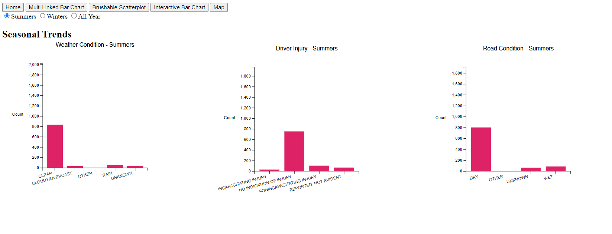
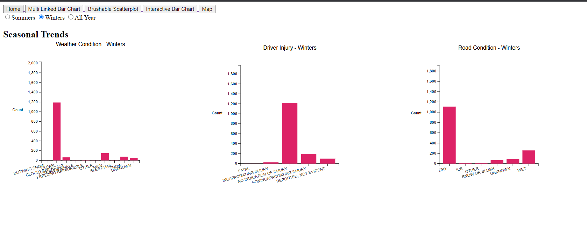
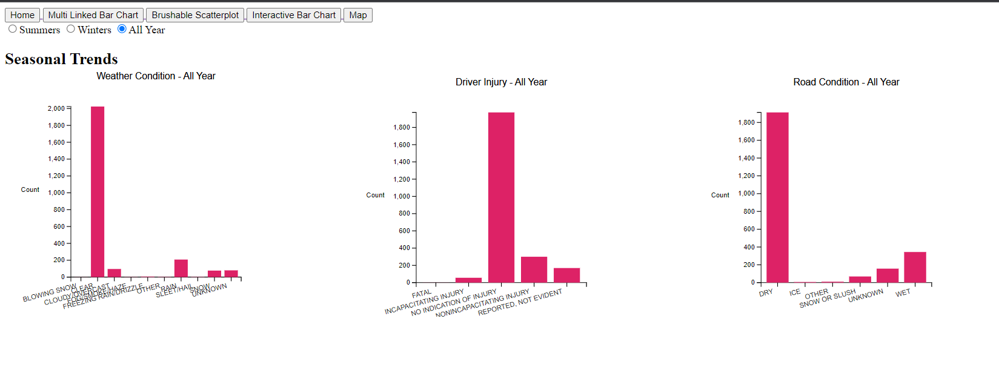

These plots don't show a definitive increase in car crashes in poor driving conditions- as most of the crashes occured when the weather was clear and the road was dry.

## 3. Multi-Linked View 1

Next up, we used a linked interactive view plot to examine the damage caused across demographics and at various times of day. To do so, we used a brushable scatterplot(Hour of day v/s Age of driver) and a set of bar plots describing the metrics that measure damage(monetary damage, number of injuries involved, and the most severe injury suffered.)
Note that the crashes are plotted using "minute of day" as the x coordinate, however, the x-axis is kept as "hour of day" for easy of interpretability.

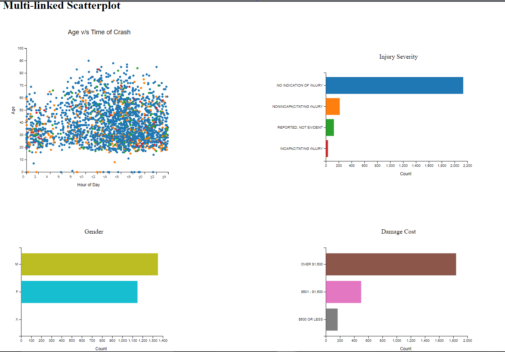
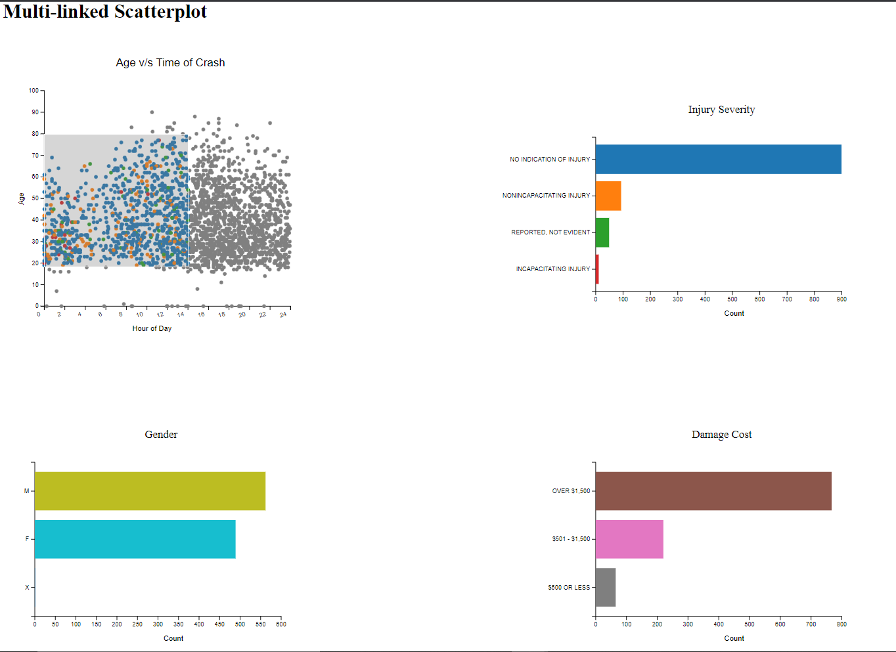

We can see that younger people tend to get in more crashes around midnight, and most of the crashes occur in the evening time.

# 4. Multi-Linked View 2

Building upon the static plot in section 1, we made another multiple linked view visualization using a clickable bar chart (Month/Number of Crashes) and a set of static bar charts that change each time a bar from the interactive bar chart is clicked. These static bar charts describe other metrics that measure the number of crashes made in certain environments(weather, road, and lighting conditions).

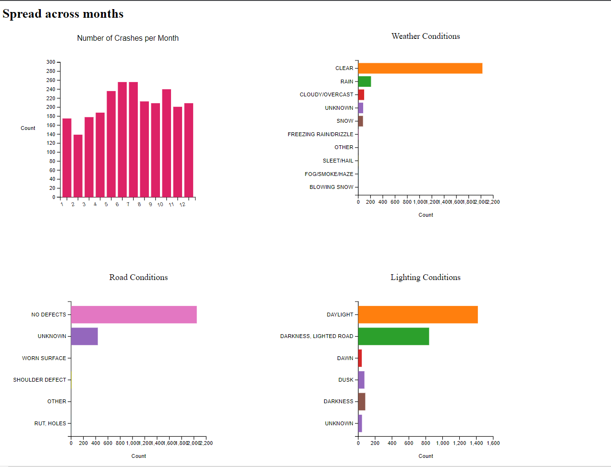

From this, we can see that all through the year, most crashes occurred on a road with no defects, during clear skies and in the daylight.

# 5. Spatial View

Finally, we plotted the crashes on a map of Chicago to explore their distribution. To increase the explorability, we added a slider that allows the user to examine the crashes throughout the day- across different hours. The map also has zooming capability.

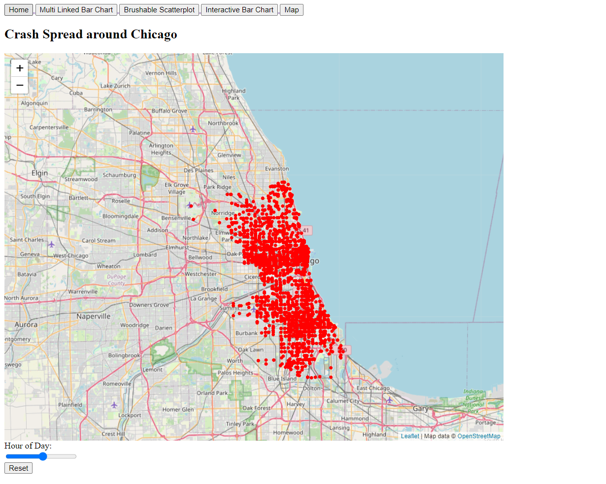
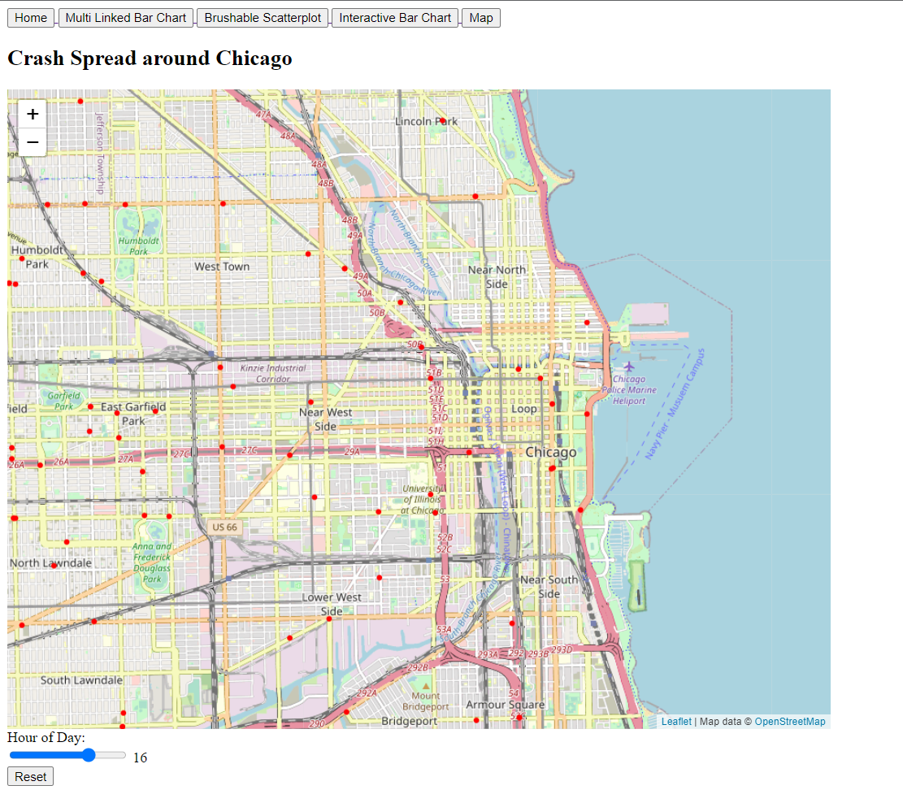

Upon exploring the map, we discover that during the early hours of the morning as well the evening hours, the crashes tend to happen outside the main city. And during the daytime, the crashes are mostly concentrated to the downtown area. A comparison of crash distributions at 7AM, 12PM, and 8PM is given below.

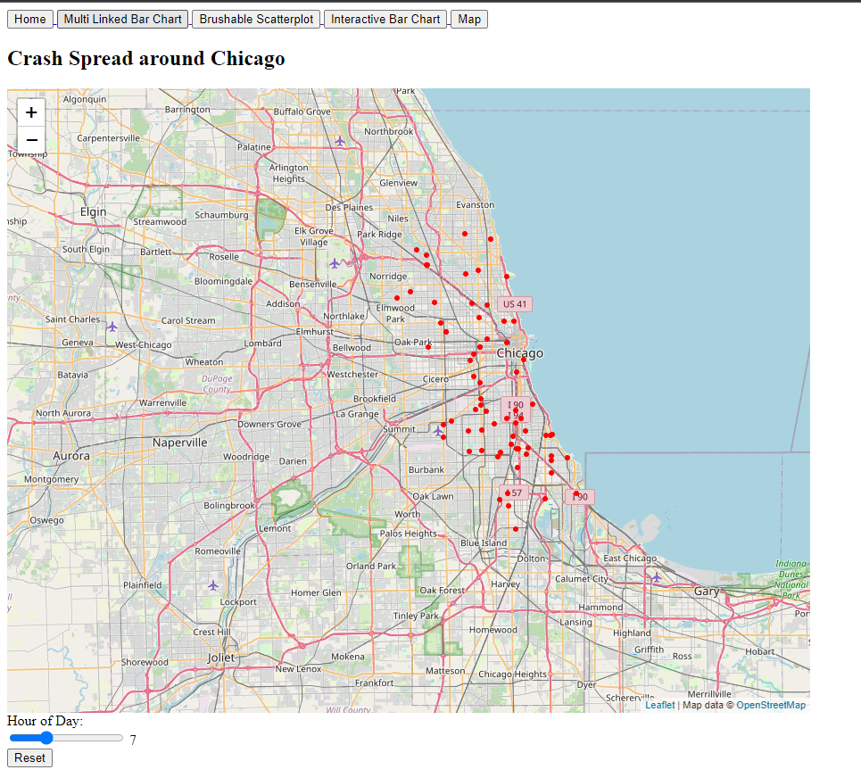
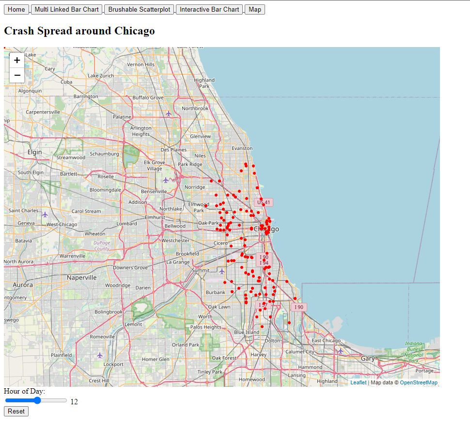
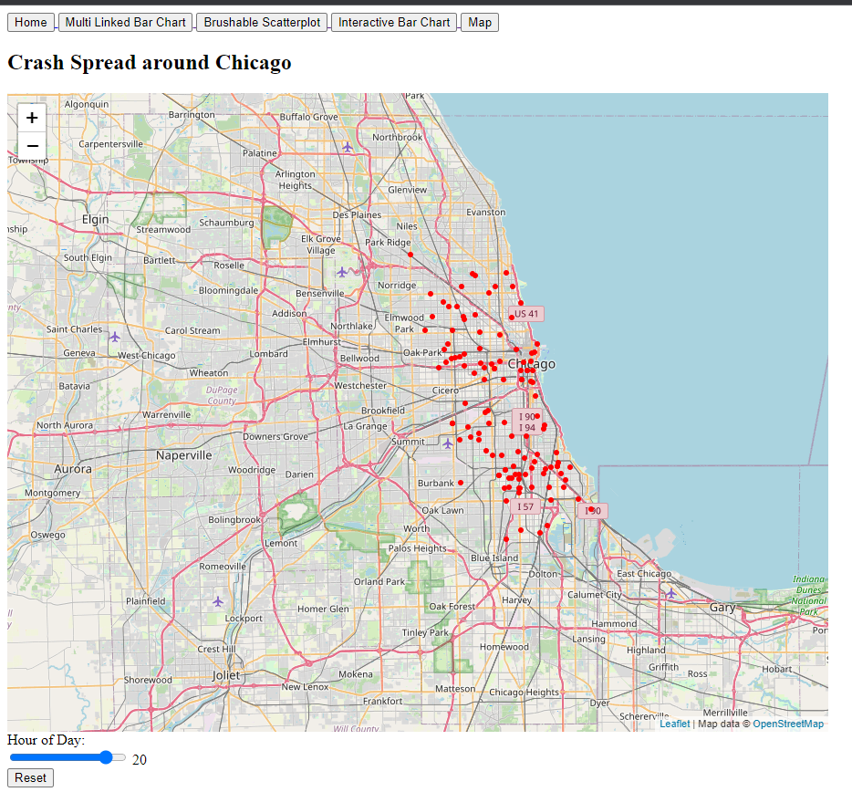

## Revisiting our Hypotheses

Let's take a look at our initial hypotheses and discover how they hold up.

1. People in their prime tend to have more crashes _*Correct!*_
2. There are more crashes in summer than winter _*Correct!*_
3. Bad driving conditions lead to more crashes
_*Incorrect!*_
4. The Downtown area has more crashes than other areas. _*Partially Correct!*_

## Conclusion

In this project, we examined the traffic crashes in Chicago for 2021 and saw how various metrics behave under specific circumstances. It was found that most of the crashes occur in ideal driving conditions- implying negligence on the driver's part. We also used an interactive brushable scatterplot- linked with bar charts- to study the distribution of traffic crashes across demographics throughout the day. Using an interactive bar chart, we further analyzed the impact of driving conditions on crashes. Finally, we plotted the crashes on a map of Chicago and explored the spatio-temporal distribution of crashes around the city.

This concludes our project, thank you for reading!
